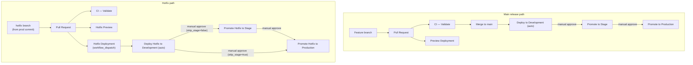

# github-delivery-workflow

Minimal reference implementation of a multi-environment GitHub Actions delivery workflow.

Demonstrates four paths:
- **Main release** — auto deploy to `development` on every merge to `main`, manual promote to `stage`, manual promote to `production`
- **PR preview** — unique preview for every non-hotfix PR (branch name does **not** contain `hotfix`), with optional promote to `stage` and `production`
- **Hotfix preview** — dedicated preview for hotfix PRs (branch name contains `hotfix`, e.g. `GDW-245-hotfix-...`), visible in PR checks, with optional promote to `stage` and `production`
- **Hotfix deployment** — manual `workflow_dispatch` from a specific production commit, with optional stage skip

## Workflows

| File | Name | Trigger | Branches | Purpose |
|---|---|---|---|---|
| `ci.yml` | CI | Pull Request → `main` | all | Validate PR |
| `deployment.yml` | Deployment | Push to `main` | `main` | Deploy → dev → stage → prod |
| `preview-deployment.yml` | Preview Deployment | Pull Request → `main` | branches **not** containing `hotfix` | Preview in dev → optional stage → optional prod |
| `hotfix-preview.yml` | Hotfix Preview | Pull Request → `main` | branches containing `hotfix` | Hotfix preview in dev → optional stage → optional prod |
| `hotfix-deployment.yml` | Hotfix Deployment | Manual (`workflow_dispatch`) | any | Hotfix from prod commit → dev → stage (optional) → prod |

## Environments

| Environment | Approval required | Example URL |
|---|---|---|
| `development` | No | `dev.example.com` |
| `stage` | Yes | `stage.example.com` |
| `production` | Yes | `app.example.com` |

## Conventions

Branches, commits, and PR titles share one convention so history reads intentionally.

- **Branch:** `GDW-{id}-short-description` (task id mandatory), e.g. `GDW-101-feature-deployment-example`, `GDW-245-hotfix-production-deployment`.
- **Commit / PR title:** `<type>: [<task-id>] <description>` (optional `<type>(<scope>): ...`). Allowed types: `feat`, `fix`, `docs`, `refactor`, `test`, `chore`, `build`, `ci`, `perf`. Descriptions describe the result, preferably in passive voice.
- **Squash merge:** the PR title becomes the squash commit on `main`, so it is the source of commit metadata.

```text
feat: [GDW-101] feature deployment flow was demonstrated
fix:  [GDW-245] hotfix deployment path was demonstrated
```

## Workflow diagram



## Build ID format

| Path | Format | Example |
|---|---|---|
| Main release | `gdw-{run_number}-1` | `gdw-3-1` |
| PR preview | `gdw-pr{pr_number}-{run_number}` | `gdw-pr2-4` |
| Hotfix preview | `gdw-hf-pr{pr_number}-{run_number}` | `gdw-hf-pr7-12` |
| Hotfix deployment | `gdw-hf-{run_number}-1` | `gdw-hf-5-1` |

## How to test

### Main release path
1. Create a `GDW-{id}-...` feature branch, make a change, open a PR — `CI` and `Preview Deployment` run automatically.
2. Merge (squash) the PR to `main` — `Deployment` runs, `Deploy to Development` completes automatically.
3. In the **Actions** tab, the run pauses at `Promote to Stage` — click **Review deployments** → **Approve and deploy**.
4. After stage succeeds, repeat the approval for `Promote to Production`.

### Hotfix path
1. Create a branch whose name contains `hotfix` (e.g. `GDW-245-hotfix-production-deployment`) from the production commit, make the fix, open a PR.
2. PR checks show `CI` and `Hotfix Preview` (not `Preview Deployment`).
3. Go to **Actions** → **Hotfix Deployment** → **Run workflow** → paste the hotfix HEAD SHA in `source_sha`.
4. `Deploy Hotfix to Development` runs automatically.
5. Approve `Promote Hotfix to Stage`, then `Promote Hotfix to Production`.

### Hotfix path — skip stage
Same as above but check `skip_stage` when running the workflow. Stage is skipped, production approval appears immediately.

## Notes

- Required reviewers on public repos work on the GitHub Free plan.
- The workflow run stays open until all jobs complete or the 30-day timeout is reached.
- On GitHub Free, you can approve your own deployments (Enterprise restricts this).
- `Preview Deployment` and `Hotfix Preview` are mutually exclusive by branch pattern — both trigger on all PRs but each runs only for its own branch type.
- Hotfix git integration (rebase onto main after production deploy) is outside the scope of these workflows.
